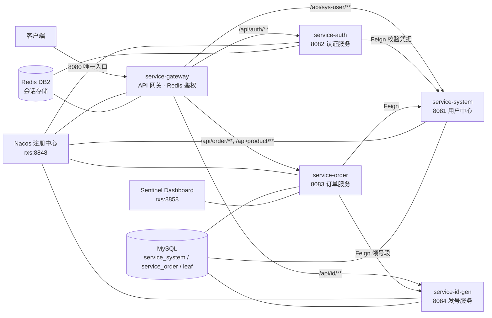

# springcloud-demo

Spring Cloud 微服务实战项目：基于 **Spring Boot 4 / Spring Cloud 2025.1 / Spring Cloud Alibaba** 的分布式应用示例，覆盖服务注册发现、统一网关鉴权、OpenFeign 服务调用、Sentinel 流量治理、Leaf 号段分布式发号等核心场景。

## 技术栈

| 类别 | 选型 |
| --- | --- |
| 语言 / 构建 | Java 21 · Maven（聚合工程） |
| 基础框架 | Spring Boot 4.0.8 |
| 微服务框架 | Spring Cloud 2025.1.0（5.0.x 线） |
| 微服务组件 | Spring Cloud Alibaba 2025.1.0.0（Nacos、Sentinel） |
| 服务调用 | OpenFeign + Spring Cloud LoadBalancer |
| 数据层 | MySQL 8 · MyBatis-Plus（`mybatis-plus-spring-boot4-starter`） |
| 缓存 / 会话 | Redis（Session Token 存储） |
| 分布式 ID | Leaf-segment 号段模式（service-id-gen） |

## 服务架构



## 模块说明

| 模块 | 端口 | 职责 |
| --- | --- | --- |
| `service-gateway` | 8080 | API 网关：统一对外入口、按路径路由、Redis 会话鉴权、CORS |
| `service-system` | 8081 | 用户中心：用户/部门/角色管理，账号密码校验（唯一落库服务） |
| `service-auth` | 8082 | 认证服务：登录签发/注销会话（无状态，不连库，会话存 Redis） |
| `service-order` | 8083 | 订单服务：下单、订单/商品/库存，Feign 调用 system 与 id-gen |
| `service-id-gen` | 8084 | 分布式发号：Leaf-segment 号段模式，双 buffer 预取 |
| `service-*-api` ×4 | — | 服务契约模块（DTO + Feign 客户端），供其他服务依赖调用 |

## 基础设施

各服务通过 Nacos 服务发现/配置中心协同，基础设施地址均为局域网主机 `rxs`（见各模块 `application.yml`，按需修改）：

| 组件 | 地址 | 账号 | 部署说明 |
| --- | --- | --- | --- |
| Nacos（注册 + 配置中心） | `rxs:8848` | nacos / 123456 | 见 `nacos.md` |
| MySQL | `rxs:3306` | root / 123456 | 见 `mysql.md` |
| Redis | `rxs:6379`（库 2 存会话） | 无密码 | 库号两侧配置必须一致 |
| Sentinel Dashboard | `rxs:8858` | sentinel / sentinel | 见 `sentinel-dashboard.md` |

## 快速开始

### 1. 初始化数据库

```bash
# 业务库（service_system / service_order）与号段库（leaf）
mysql -h rxs -u root -p123456 < sql/create_databases.sql
mysql -h rxs -u root -p123456 < sql/id-gen.sql

# 各服务表结构（sql.init.mode=never，启动不自动建表）
mysql -h rxs -u root -p123456 service_system < sql/ry_20260417.sql
# service-order 表结构见 service-order/src/main/resources/schema.sql
```

> 注：`service-auth` 不落库；演示账号 `admin` / `admin123`（含角色、部门等种子数据）见 `service-system/src/main/resources/schema.sql`，供 H2 本地运行与单元测试使用，生产库请自行初始化 `sys_user`。

### 2. 构建

```bash
./mvnw clean package -DskipTests
```

### 3. 启动服务

按依赖顺序依次启动（每个模块 `mvn spring-boot:run` 或直接运行其 `*Application.java`）：

```text
service-id-gen → service-system → service-auth → service-order → service-gateway
```

### 4. 验证

```bash
# 登录获取令牌（唯一免鉴权入口）
curl -X POST http://localhost:8080/api/auth/login \
  -H 'Content-Type: application/json' \
  -d '{"username":"admin","password":"admin123"}'

# 携带令牌访问业务接口
curl http://localhost:8080/api/sys-user/list \
  -H 'Authorization: Bearer <token>'
```

## 网关路由与鉴权

| 路由 | 目标服务 |
| --- | --- |
| `/api/sys-user/**` | service-system |
| `/api/auth/**` | service-auth |
| `/api/order/**` | service-order |
| `/api/product/**` | service-order |
| `/api/id/**` | service-id-gen（仅供调试观察号段） |

鉴权采用 **Redis Session Token** 方案（不引入 Spring Security）：

- 登录后会话写入 Redis（库 2），网关 `TokenAuthFilter` 直接读 Redis 判定，认证服务不在请求主链路上；
- 默认拦截全部请求，仅白名单（`/api/auth/login`）免鉴权；支持滑动续期（默认 30 分钟）；
- 鉴权通过后网关注入 `X-User-Id` / `X-Username` 请求头供下游使用（并覆盖客户端伪造的同名头）。

## 目录结构

```text
springcloud-demo
├── service-gateway       # 网关
├── service-system        # 用户中心 + system-api 契约
├── service-auth          # 认证 + auth-api 契约
├── service-order         # 订单 + order-api 契约
├── service-id-gen        # 发号 + id-gen-api 契约（含号段消费组件）
├── sql/                  # 建库脚本、业务库/号段库 DDL
├── docs/                 # 架构与设计文档（HTML）
└── nacos.md · mysql.md · sentinel-dashboard.md   # 基础设施部署说明
```

## 相关文档

- `docs/`：网关鉴权详解、请求链路图、服务容错（熔断/降级/限流）、CORS 惯例、学习路径等
- 各模块 `application.yml` 内含大量设计决策注释（如 MyBatis-Plus 版本选型、号段库独立原因、会话续期一致性等），是理解本项目的最佳入口
